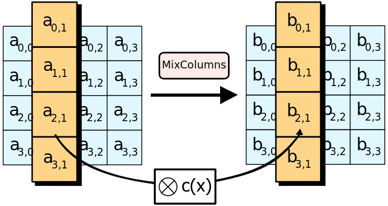

ASE加密

> DES算法的密钥长度只有56位，这对于穷举式密钥检索攻击基本没有抵抗力。
>
> 与DES不同的是，AES算法没有采用Feistel密码结构体系。

### AES的特性

- 分组大小为128位
- 有三种秘钥长度可供选择，分别是128，192及256位
- 依秘钥的长度不同，运算的轮次从10轮到14轮不等
- 每轮包含4个函数，分为3个层次。如下列出了4个函数（括号中表明了响应的层次）：
  - SubByte（非线性层）
  - ShiftRow（线性混合层）
  - MixColumn（非线性层）
  - AddRoundkey（密钥添加层）

---

### 总体结构


---

### 密钥扩展算法（Key Expansion）

- 每一轮的每一个位置都是上一轮该位置的值与当前位置的前一个位置的异或。
- 每一轮的第一个位置特殊处理。


---

### 字节代替（Substitute Bytes）部分

- 将指定位置的数0x(f1)(f2)分成两个部分(f1)和(f2)。
- 根据S盒获取行为(f1)，列为(f2)位置的数替换原来位置的数。


---

### 行位移（ShiftRow）部分

- 第一行往左循环位移0个位置
- 第二行往左循环位移1个位置
- 第三行往左循环位移2个位置
- 第四行往左循环位移3个位置


---

### 列混合（MixColumn）部分

- 列变化是通过矩阵相乘得到的


- 列混合是通过将state矩阵与常矩阵C相乘以达成在列上的扩散，属于代替变化。本质上是**有限域(2^8)**上的多项式乘法运算。




> 域：在加法和乘法上具有封闭性，也就是说域中的元素进行加法或者乘法后的结果任然是该域中的元素。（此处的加法或者乘法不一定是我们平常所使用的加法或者乘法）
>
> 单位元：对于加法单位元，一个数加上单位元等于本身。对于乘法单位元，一个数乘以单位元等于本身。通常使用e表示。
>
> 逆元：类似数学上的倒数。如果元素a与元素b互为加法逆元，那么有a+b = e。同理乘法逆元也是一样。
>
> 域的必要条件：一个集合有加法单位逆元，和乘法单位逆元，以及每一个元素都有对应的加法单位逆元和乘法单位逆元。（若是有0，并且0没有对应的乘法逆元，这个集合同样可能是一个域）
>
> 有限域(伽罗华域)：指域中的元素个数是有限的域。


>有限域GF(p)，其中p为素数：
>
>- 简单来说GF(p)就是mod p，结果在0-(p-1)之间。对于元素a和b，(a+b) mod p和(a*b) mod p 的结果都是在域中。
>- GF(p)中的加法，乘法运算就是普通的加法和乘法运算。GF(p)的加法单位元是0，乘法单位元是1。
>- 为什么p是素数：因为p是素数才能保证域中所有的元素都有逆元。（利用费马小定理可以证明）


> 有限域GF(2^8)：
>
> > 多项式运算：（x^6+x^4+x^2+x+1）
> >
> > - 多项式的系数只能为0或1
> > - 合并同类项的时候，系数进行异或操作。
> > - 减法就是加法
>
> > 素多项式：素多项式不能由其他多项式相乘得到。
> >
> > - 指数小于3的多项式有8个。
> > - 对于GF(2^3)来说，其中一个素多项式为x^3+x+1，上面8个多项式进行四则运算后mod (x^3+x+1)的结果都是8个中的一个。同样也可以证明这是一个域，所以**每一个多项式都是有加法和乘法逆元**
> > - 对于GF(2^8)来说，其中一个素多项式为**x^8+x^4+x^3+1**。对应的，小于8次的多项式有256个。
>
> > 多项式对应的值，就是每个多项式系数的组成。例如（x^6+x^2+x+1 = 1000110）


> GF(2^8)的四则运算：
>
> - 加法和减法：就是普通的异或运算。
>
> - 乘法：
>   - 递归运算
>
>   ``` 
>   x^8 mode (x^8+x^4+x^3+1) = x^4 + x^3 + 1
>
>   f(x) = b7x^7 + b6x^6 + b5x^5 + b4x^4 + b3x^3 + b2x^2 + b1x^1 + b0
>   x * f(x) = b7x^8 + b6x^7 + b5x^6 + b4x^5 + b3x^4 + b2x^3 + b1x^2 + b0x^1 
>
>   如果b7 = 0,那么结果是一个小于8的多项式，不需要取模运算了。
>   若果b7 = 1,那么x * f(x) = (b7x^8 + b6x^7 + b5x^6 + b4x^5 + b3x^4 + b2x^3 + b1x^2 + b0x^1) + (x^4 + x^3 + x + 1)
>   ```
>
>   - 对于x的指数高于一次的情况，可以通过递归的形式使用
>     
>     
>     
>

---

### 轮密钥加（Add Round Key）部分

- 将指定位置的值与当前轮的子秘钥进行异或操作生成新的状态（state）


### 参考资料

- [AES加密算法详解](https://blog.csdn.net/qq_28205153/article/details/55798628)
- [AES详解](https://github.com/matt-wu/AES)
- [有限域](https://blog.csdn.net/luotuo44/article/details/41645597)
- [伽罗华域](https://blog.mythsman.com/2016/09/11/2/)